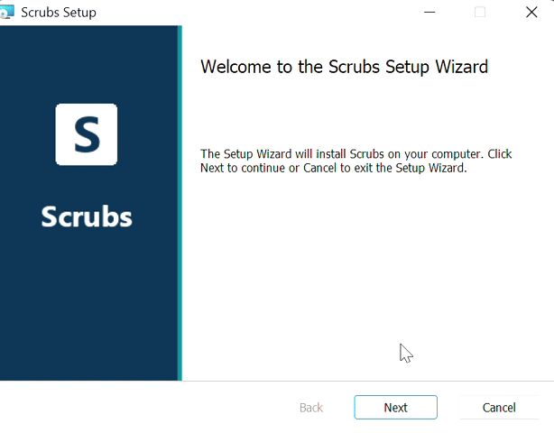

# Scrubs

Clinicians already paste patient notes into chatbots to write letters and summaries. Scrubs lets them keep doing that without the chatbot learning who the patient is.

You upload a PDF or paste a note. Scrubs flags the identifiers, you check them, and the ones you mask are swapped for placeholders like `[PATIENT_01]`. Only that version goes to Gemini. When the answer comes back, the real names are put back in on your screen.

We built it at StormHacks 2026 (Armin, Felix, Krish and Nathan). Every document in this repo is made up. Don't put real patient data in it.

## How it works

1. Upload a text-based PDF or paste a note.
2. Scrubs looks for identifiers in three ways. Presidio handles the standard ones and we added BC rules to it (PHN check digit, postal codes, MRNs, prescriber numbers). GLiNER, a small local model, catches indirect ones like "the retired town pharmacist". A list of BC towns, facilities and job titles catches the rest.
3. You review the flags. HIGH items (names, health numbers, addresses) are always masked. MED items (exact dates, small towns, employers) are masked unless you unmask them. LOW items (drugs, doses, diagnoses) are kept unless you mask them. Click any highlight to change it.
4. You chat. Ask for a referral letter, a discharge summary or a handoff note. Gemini only gets the placeholders. Dates are moved by the same number of days, so the gaps between them stay right.

Documents, flags and the placeholder mapping are kept in memory only and are gone when you restart. The one exception is the optional Snowflake audit log, which records mask and unmask decisions as counts with no document text.

## Install the desktop app (Windows)



1. Download `Scrubs-0.1.0.msi` from the [Releases page](../../releases). It's about 930 MB.
2. Run it. The installer isn't code-signed, so Windows will show "Windows protected your PC". Click **More info**, then **Run anyway**.
3. Pick an install folder or keep the default (`C:\Program Files\Scrubs`).
4. Open Scrubs. The first time, it asks for a Gemini API key and saves it in Windows Credential Manager. You can leave it blank and use Scrubs without the chat.
5. It shows "Starting Scrubs" for up to a minute while the detection models load.

Detection runs on your computer. The only thing that goes over the internet is the masked text you send to the chat.

To change the API key, open Credential Manager, go to Windows Credentials, delete the **Scrubs** entry and restart the app. To uninstall, use Settings > Apps.

## Running it locally

Backend, using Python 3.11:

```
py -3.11 -m venv backend\.venv
backend\.venv\Scripts\pip install -r requirements.txt
backend\.venv\Scripts\python -m spacy download en_core_web_sm
copy .env.example .env
cd backend
.venv\Scripts\python app.py
```

Put your `GEMINI_API_KEY` in `.env` before starting. The API runs on http://127.0.0.1:5000.

Frontend, in a second terminal from the repo root:

```
npm install
npm run dev
```

It runs on http://localhost:3000. To try the frontend with sample data and no backend, set `NEXT_PUBLIC_USE_MOCK=1` in `.env`.

## Where things are

| Path | What's there |
|---|---|
| `app/`, `lib/` | Next.js frontend |
| `backend/` | Flask API, with the detection code in `backend/pipeline/` |
| `desktop/` | Windows app and MSI build, see [desktop/README.md](desktop/README.md) |
| `eval/` | Synthetic test notes and `eval/run.py`, which scores default Presidio against our pipeline, see [eval/README.md](eval/README.md) |
| `data/` | BC lexicon and sample PDFs |
| `CLAUDE.md` | The full project spec |

## Sponsor tracks

- Gemini API runs the chat, and only ever sees masked text.
- TiDB holds the BC lexicon. The app downloads it read-only and matches against it locally.
- Snowflake stores the audit log of mask and unmask decisions. It holds counts, never document text.

## Limits

This is a hackathon prototype and hasn't been validated for clinical use. Check the flagged items yourself before you send anything.
